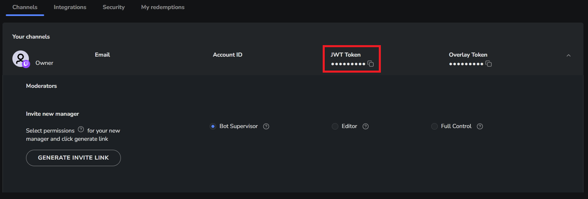

# StreamElements Tip Tracker

A Micronaut-based web application that displays a ranked list of top tippers from a StreamElements channel.

## Prerequisites

- Java 25
- StreamElements JWT Token (see below)

## Configuration

The application requires a StreamElements JWT token to authenticate with the API. You can provide this in several ways:

### 1. Environment Variables (Recommended)
Set the environment variables before running the application:

#### Powershell

```powershell
$env:SE_JWT_TOKEN="your_jwt_token_here"
$env:SE_START_TIMESTAMP="2024-01-01T00:00:00Z"
.\gradlew.bat run
```

#### Bash

```bash
export SE_JWT_TOKEN="your_jwt_token_here"
export SE_START_TIMESTAMP="2024-01-01T00:00:00Z"
./gradlew.bat run
```

### 2. Local Configuration File
Create a file named `src/main/resources/application-local.yml` (this file is ignored by Git):

```yaml
streamelements:
  jwt-token: "your_jwt_token_here"
  start-timestamp: "2024-01-01T00:00:00Z"
```

Then run with the `local` environment enabled:
```powershell
.\gradlew.bat run -Dmicronaut.environments=local
```

### 3. Application Defaults
You can also modify `src/main/resources/application.yml` directly, though this is not recommended for secrets.

### Configuring the Start Date

By default, the application tracks tips from `2024-01-01T00:00:00Z`. You can change this using the `SE_START_TIMESTAMP` environment variable or by adding `start-timestamp` to your `application-local.yml`. The value must be an ISO-8601 formatted timestamp.

## Finding your JWT Token

To find your Personal Access Token:
1. Log in to the [StreamElements Dashboard](https://streamelements.com/dashboard).
2. Go to [Channel Settings](https://streamelements.com/dashboard/account/channels).
3. Locate the correct channel and click the copy button next to "JWT Token"



## How to Run

### Command Line (Gradle)
Run the following command in the project root:
```powershell
.\gradlew.bat run
```
The application will be available at `http://localhost:8080`.

### IntelliJ IDEA
1. Open the project in IntelliJ IDEA (ensure you have the Groovy plugin installed).
2. Wait for Gradle to sync.
3. Locate `src/main/groovy/gg/xp/Application.groovy`.
4. Right-click the `main` method and select **Run 'Application'**.
5. To set environment variables or Micronaut environments, edit the **Run Configuration**.

